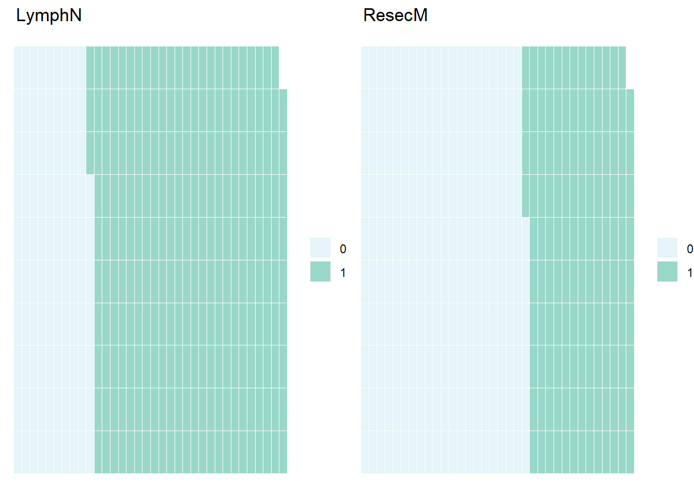
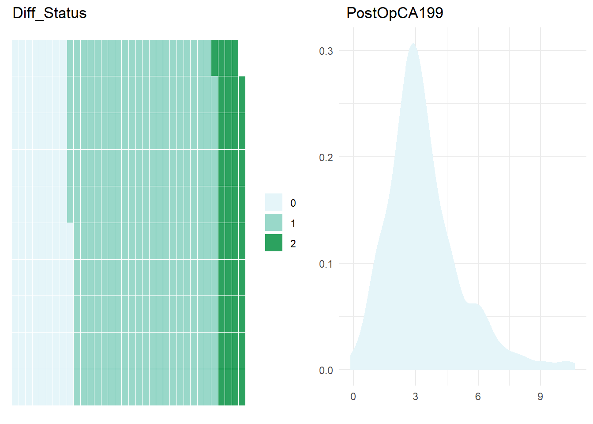
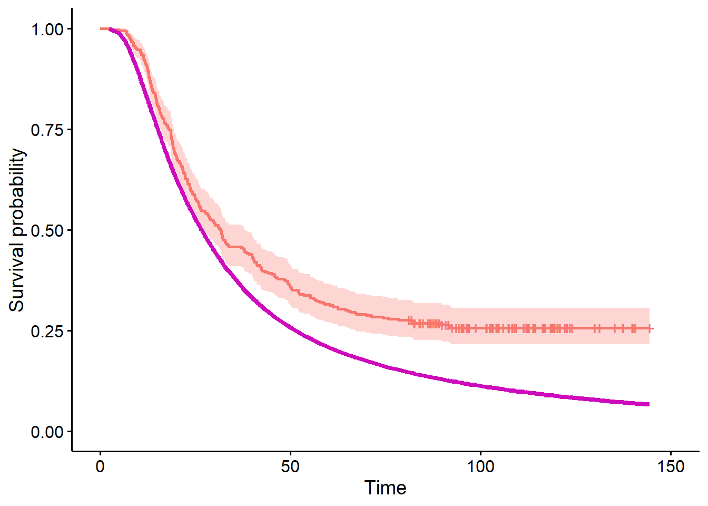
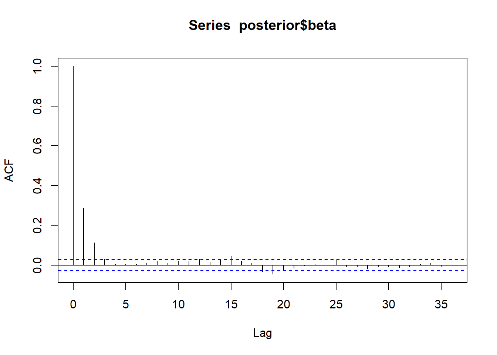
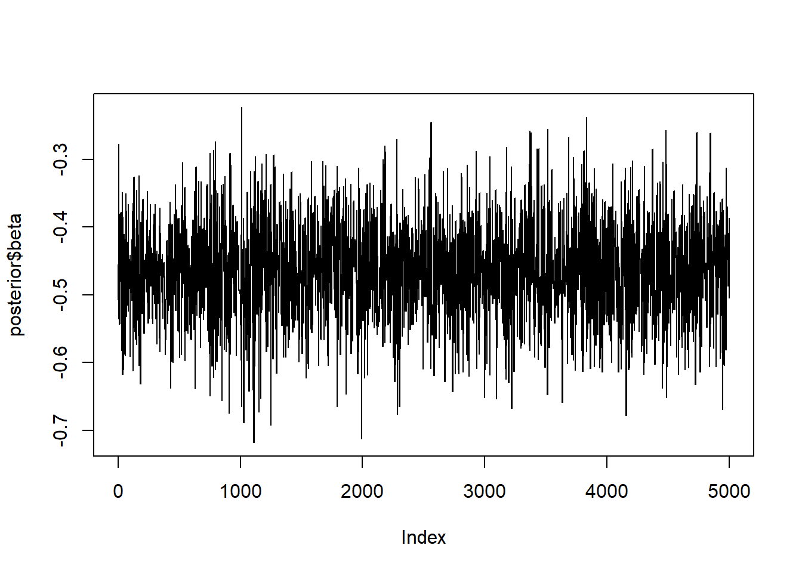

<body class="fullcontent">

<main class="content" id="quarto-document-content">

<header id="title-block-header" class="quarto-title-block default">

<h1 class="title">Model Estimated Controls for Survival Outcomes</h1>

    
  
    
  

  

</header>

<section id="introduction" class="level2">
<h2 class="anchored" data-anchor-id="introduction">Introduction</h2>

Model estimated controls (MECs) are statistical models that can be used to assess the efficacy of new therapies without needing to use clinical trials.

MECs can act as counterfactual evidence (a way to predict ‘what if?’- i.e., how would patients respond if they had received a different treatment?)

For survival outcomes, MECs can be used as a control to compare the effect of a control treatment against the effect of an observed experimental treatment on overall survival in patients.

We will implement MECs using the ‘psc’ package which specifically allows for the comparison of patient groups treated with an experimental treatment against a counterfactual model.

Let’s first install and load the ‘psc’ and other necessary packages:

<pre class="sourceCode r code-with-copy"><code class="sourceCode r"># install.package("psc")
library(psc)
library(survival)
library(ggpubr)</code><button title="Copy to Clipboard" class="code-copy-button"><i class="bi"></i></button></pre>

<pre><code>Loading required package: ggplot2</code></pre>

</section>
<section id="an-example" class="level2">
<h2 class="anchored" data-anchor-id="an-example">An example</h2>

In this example, we will look at survival outcomes in patients with pancreatic cancer from the ESPAC (European Study for Pancreatic Cancer)-4 trial and compare how the survival of patients differs with two different treatments…

We are going to load the model that is going to act as the control treatment (the counterfactual evidence discussed above). This model is a flexible parametric model that was created using the ‘flexsurv’ package.

We can look at the model in more detail

<pre class="sourceCode r code-with-copy"><code class="sourceCode r">load("M:/Documents/Projects/Fellowship/modelDevelop/PDAC/Output/Models/flsm.R")

flsm$call
class(flsm)</code><button title="Copy to Clipboard" class="code-copy-button"><i class="bi"></i></button></pre>

So now that we have our control treatment, monotherapy gemcitabine (GEM), we will load the ESPAC-4 dataset. ESPAC-4 consists of patients that have been treated with the experimental treatment, adjuvant gemcitabine and capecitabine, GEMCAP.

Our aim is to compare the ESPAC-4 dataset against the GEM model to determine which of the treatments is more effective.

It is important that the variables present in the model are also present in the comparison dataset. It is also important that the time variable in the model’s survival object and in the comparison dataset are encoded as ‘time’.

<pre class="sourceCode r code-with-copy"><code class="sourceCode r">load("M:/Documents/Projects/Fellowship/modelDevelop/PDAC/Data/espac4gemcap.R")
head(espac4_gemcap[1:3,])</code><button title="Copy to Clipboard" class="code-copy-button"><i class="bi"></i></button></pre>

<pre><code>  ResecM LymphN Diff_Status  treat      time cen PostOpCA199
2      0      1           2 GEMCAP  8.707019   1    1.383791
5      0      0           0 GEMCAP 49.277267   1    0.000000
8      0      1           1 GEMCAP  6.735929   1    1.824549</code></pre>

<pre class="sourceCode r code-with-copy"><code class="sourceCode r">head(flsm$data$m[1:3,])</code><button title="Copy to Clipboard" class="code-copy-button"><i class="bi"></i></button></pre>

<pre><code>   Surv(time, cen) LymphN ResecM Diff_Status PostOpCA199 (weights)
18        11.30092      1      0           0    6.222576         1
19        14.81603      1      0           1    4.394449         1
28        17.18134      1      0           2    9.314430         1</code></pre>

<pre class="sourceCode r code-with-copy"><code class="sourceCode r">names(flsm$data$m[,2:5])%in%names(espac4_gemcap)</code><button title="Copy to Clipboard" class="code-copy-button"><i class="bi"></i></button></pre>

<pre><code>[1] TRUE TRUE TRUE TRUE</code></pre>

We should also check the the variables are the correct class…

Categorical variables should be class factor and continuous variables should be numeric.

<pre class="sourceCode r code-with-copy"><code class="sourceCode r">str(espac4_gemcap)</code><button title="Copy to Clipboard" class="code-copy-button"><i class="bi"></i></button></pre>

<pre><code>'data.frame':   362 obs. of  7 variables:
 $ ResecM     : Factor w/ 2 levels "0","1": 1 1 1 2 2 2 2 1 2 2 ...
 $ LymphN     : Factor w/ 2 levels "0","1": 2 1 2 1 2 1 2 1 1 1 ...
 $ Diff_Status: Factor w/ 3 levels "0","1","2": 3 1 2 2 1 1 1 2 3 2 ...
 $ treat      : chr  "GEMCAP" "GEMCAP" "GEMCAP" "GEMCAP" ...
 $ time       : num  8.71 49.28 6.74 21.91 23.55 ...
 $ cen        : int  1 1 1 1 1 0 0 1 0 0 ...
 $ PostOpCA199: num  1.38 0 1.82 1.13 5.86 ...</code></pre>

</section>
<section id="fit-counterfactual-model" class="level2">
<h2 class="anchored" data-anchor-id="fit-counterfactual-model">Fit counterfactual model :)</h2>

Now that we have checked the correct variables are in our dataset and that they are encoded correctly, we can turn the flexible parametric model into a counterfactual model. We will use the pscfit() function:

<pre class="sourceCode r code-with-copy"><code class="sourceCode r">cfm &lt;- pscCFM(flsm)</code><button title="Copy to Clipboard" class="code-copy-button"><i class="bi"></i></button></pre>

It is possible to visualise and summarise the data that was used to fit this model with the built in functions within pscCFM():

<pre class="sourceCode r code-with-copy"><code class="sourceCode r">cfm$datasumm$summ_Table</code><button title="Copy to Clipboard" class="code-copy-button"><i class="bi"></i></button></pre>

<table class="gt_table caption-top table table-sm table-striped small" data-quarto-postprocess="true" data-quarto-disable-processing="false" data-quarto-bootstrap="false">
<colgroup>
<col style="width: 50%">
<col style="width: 50%">
</colgroup>
<thead>
<tr class="gt_col_headings header">
<th id="label" class="gt_col_heading gt_columns_bottom_border gt_left" data-quarto-table-cell-role="th" scope="col"><strong>Characteristic</strong></th>
<th id="stat_0" class="gt_col_heading gt_columns_bottom_border gt_center" data-quarto-table-cell-role="th" scope="col"><strong>N = 339</strong>1</th>
</tr>
</thead>
<tbody class="gt_table_body">
<tr class="odd">
<td class="gt_row gt_left" headers="label">LymphN</td>
<td class="gt_row gt_center" headers="stat_0"> 
</td>
</tr>
<tr class="even">
<td class="gt_row gt_left" headers="label">&nbsp;&nbsp;&nbsp;&nbsp;0</td>
<td class="gt_row gt_center" headers="stat_0">97 (29%)</td>
</tr>
<tr class="odd">
<td class="gt_row gt_left" headers="label">&nbsp;&nbsp;&nbsp;&nbsp;1</td>
<td class="gt_row gt_center" headers="stat_0">242 (71%)</td>
</tr>
<tr class="even">
<td class="gt_row gt_left" headers="label">ResecM</td>
<td class="gt_row gt_center" headers="stat_0"> 
</td>
</tr>
<tr class="odd">
<td class="gt_row gt_left" headers="label">&nbsp;&nbsp;&nbsp;&nbsp;0</td>
<td class="gt_row gt_center" headers="stat_0">206 (61%)</td>
</tr>
<tr class="even">
<td class="gt_row gt_left" headers="label">&nbsp;&nbsp;&nbsp;&nbsp;1</td>
<td class="gt_row gt_center" headers="stat_0">133 (39%)</td>
</tr>
<tr class="odd">
<td class="gt_row gt_left" headers="label">Diff_Status</td>
<td class="gt_row gt_center" headers="stat_0"> 
</td>
</tr>
<tr class="even">
<td class="gt_row gt_left" headers="label">&nbsp;&nbsp;&nbsp;&nbsp;0</td>
<td class="gt_row gt_center" headers="stat_0">85 (25%)</td>
</tr>
<tr class="odd">
<td class="gt_row gt_left" headers="label">&nbsp;&nbsp;&nbsp;&nbsp;1</td>
<td class="gt_row gt_center" headers="stat_0">214 (63%)</td>
</tr>
<tr class="even">
<td class="gt_row gt_left" headers="label">&nbsp;&nbsp;&nbsp;&nbsp;2</td>
<td class="gt_row gt_center" headers="stat_0">40 (12%)</td>
</tr>
<tr class="odd">
<td class="gt_row gt_left" headers="label">PostOpCA199</td>
<td class="gt_row gt_center" headers="stat_0">3.04 (2.30, 4.14)</td>
</tr>
</tbody><tfoot class="gt_footnotes">
<tr class="odd">
<td colspan="2" class="gt_footnote">1 n (%); Median (Q1, Q3)</td>
</tr>
</tfoot>

</table>

<pre class="sourceCode r code-with-copy"><code class="sourceCode r">ggarrange(plotlist = cfm$datavis, ncol = 2)</code><button title="Copy to Clipboard" class="code-copy-button"><i class="bi"></i></button></pre>

<pre><code>$`1`</code></pre>

<figure class="figure">

</figure>

<pre><code>
$`2`</code></pre>

<figure class="figure">

</figure>

<pre><code>
attr(,"class")
[1] "list"      "ggarrange"</code></pre>

</section>
<section id="make-comparison" class="level2">
<h2 class="anchored" data-anchor-id="make-comparison">Make comparison!</h2>

We have now created a counterfactual model which can be compared against the ESPAC-4 data cohort. The comparison can be carried out using the pscfcit() function.

Don’t forget that the pscfit() function requires the ‘time’ variables in the data cohort and in the counterfactual model to be encoded as ‘time’ and the event variable to be encoded as ‘cen’. The variable names need to be the exact same.

<pre class="sourceCode r code-with-copy"><code class="sourceCode r">psc &lt;- pscfit(cfm, espac4_gemcap)</code><button title="Copy to Clipboard" class="code-copy-button"><i class="bi"></i></button></pre>

The output of the comparison can be visualised. The plot below visualises the effect of each treatment on ESPAC-4 patients. The pink line represents the model’s predicted survival estimates (if the ESPAC-4 patients had been treated with GEM) and the orange line represents the data cohort’s observed survival estimates.

<pre class="sourceCode r code-with-copy"><code class="sourceCode r">plot(psc)</code><button title="Copy to Clipboard" class="code-copy-button"><i class="bi"></i></button></pre>

<figure class="figure">

</figure>

The summary of the model can be obtained using the generic summary() function to show the posterior density. The posterior estimates of the deviance information criterion (DIC) and the efficacy parameter, \(\beta\), are calculated and shown.

\(\beta\) is a measurement of the distance between the observed data and the model estimate. The 2.5 and 97.5% quantiles are also given. The odds ratio comparing the experimental treatment to the control can be calculated as exp(\(\beta\)), in this case exp(-0.466452).

<pre class="sourceCode r code-with-copy"><code class="sourceCode r">summary(psc)</code><button title="Copy to Clipboard" class="code-copy-button"><i class="bi"></i></button></pre>

<pre><code>Summary: 
 
362 observations selected from the data cohort for comparison 
CFM of type flexsurvreg identified  
linear predictor succesfully obtained with median: 
 trt: 0.812
Average expected response: 
 trt: 28.337
Average observed response: 31.67 

Counterfactual Model (CFM): 
A model of class 'flexsurvreg' 
 Fit with 5 internal knots

Formula: 
Surv(time, cen) ~ LymphN + ResecM + Diff_Status + PostOpCA199
&lt;environment: 0x000002bd2cc745b0&gt;

Call:
 CFM model + beta

Coefficients:
      median     2.5%       97.5%      Pr(x&lt;0)    Pr(x&gt;0)  
beta    -0.4654    -0.5980    -0.3374     1.0000     0.0000
DIC   1321.9110  1298.1965  1356.4793         NA         NA</code></pre>

We can extract the posterior distribution of the ‘psc’ and can view its autocorrelation and trace

<pre class="sourceCode r code-with-copy"><code class="sourceCode r">posterior &lt;- psc$posterior
head(posterior[1:3,])</code><button title="Copy to Clipboard" class="code-copy-button"><i class="bi"></i></button></pre>

<pre><code>     gamma0   gamma1    gamma2     gamma3     gamma4     gamma5     gamma6
1 -11.38080 3.835982 1.2911623 -1.3176560  1.1190182 -0.8876277  0.3372484
2 -12.67794 4.229261 0.7241809  1.9009958 -4.7052873  3.8123302 -1.1898916
3 -10.31870 3.250702 0.5695342 -0.6962649  0.7173846 -0.3868049  0.1740992
    LymphN1    ResecM1 Diff_Status1 Diff_Status2 PostOpCA199       beta
1 0.4876152 0.18053219   -0.4160534   -0.5897823   0.2671471 -0.4552224
2 0.9674277 0.07947108   -0.3650303   -0.4154747   0.2506839 -0.4552224
3 0.6713722 0.24288970   -0.5539652   -0.6549099   0.2414302 -0.5074574
       DIC
1       NA
2 1306.578
3 1313.935</code></pre>

<pre class="sourceCode r code-with-copy"><code class="sourceCode r"># autocorrelation
acf(posterior$beta)</code><button title="Copy to Clipboard" class="code-copy-button"><i class="bi"></i></button></pre>

<figure class="figure">

</figure>

<pre class="sourceCode r code-with-copy"><code class="sourceCode r"># trace
plot(posterior$beta, type = 's')</code><button title="Copy to Clipboard" class="code-copy-button"><i class="bi"></i></button></pre>

<figure class="figure">

</figure>

</section>
<section id="take-homes" class="level2">
<h2 class="anchored" data-anchor-id="take-homes">Take homes</h2>
<ul>
<li>
Check your data is formatted correctly (variable names should exactly match that of the model’s)
</li>
<li></li>
</ul>
</section>

</main>
<!-- /main column -->

 <!-- /content -->

</body>
